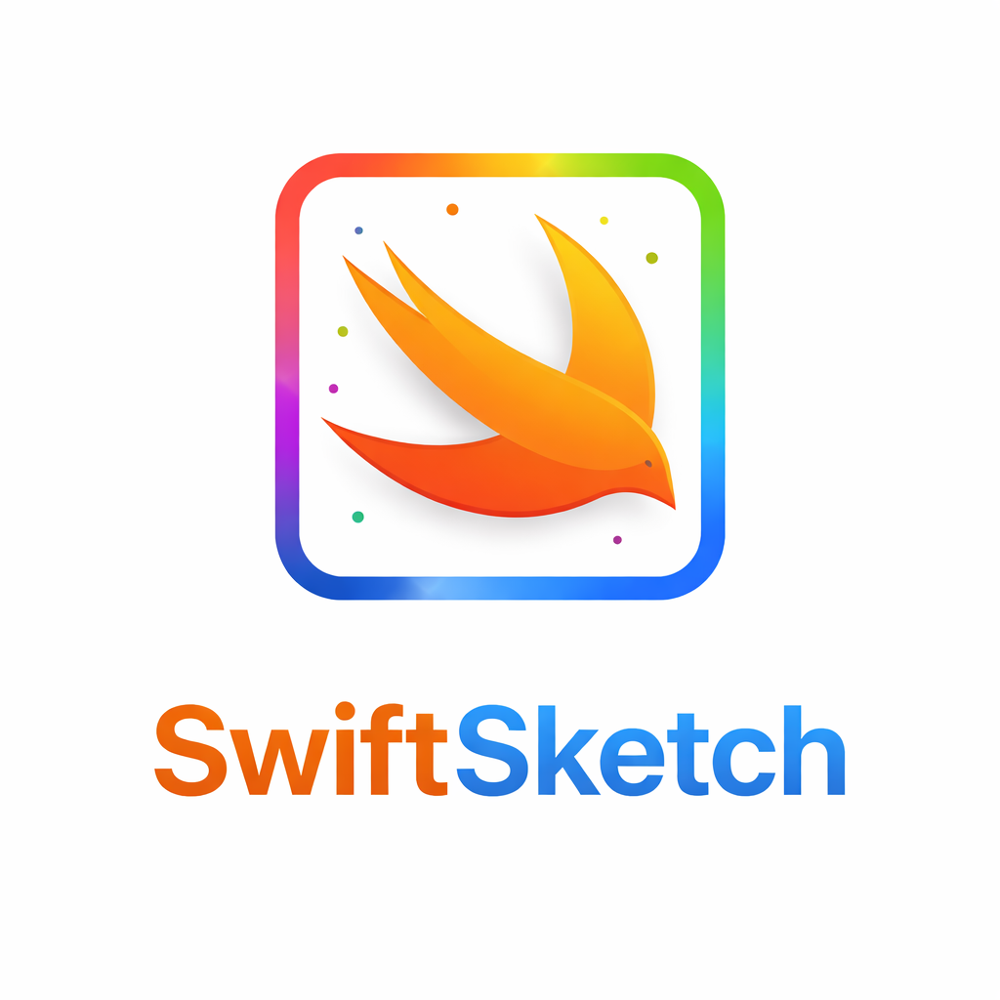
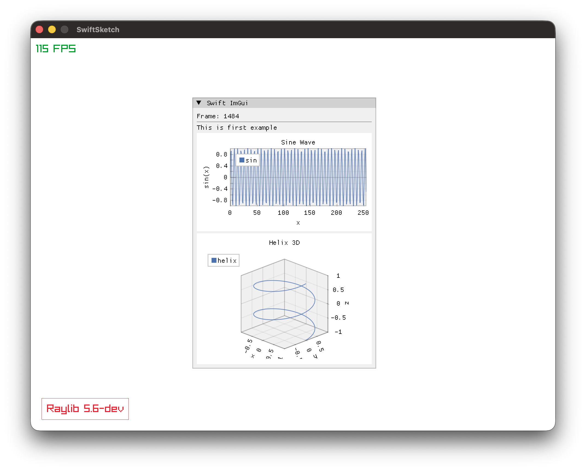
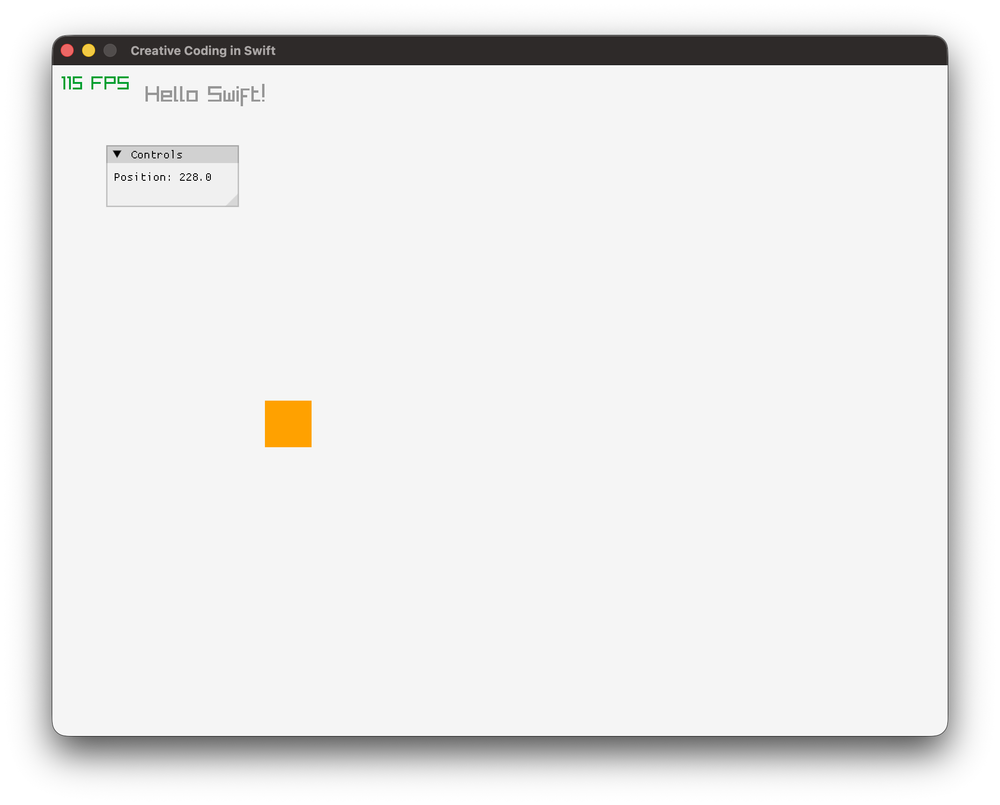

<p align="center">
  
</p>

# SwiftSketch

A high-performance creative coding framework for Swift, inspired by Processing. It combines a sketch-based workflow with **Raylib** for rendering and **ImGui/ImPlot** for tooling.

<p align="center">
  
</p>

> **Work in Progress**: This project is currently in active development. The API is not yet stable, and it is not distributed as a standalone Swift Package.
>
> **Usage**: Please treat this repository as a **Template**. You can clone or fork it to start your own creative coding projects, but be aware that breaking changes may occur.

## Platform Note

**macOS Only**: This project uses [ANGLE](https://chromium.googlesource.com/angle/angle) to translate OpenGL ES calls to **Metal**. It is currently designed exclusively for macOS, with no plans for other OS support.

> **Why ANGLE?**
>
> Apple has deprecated native OpenGL support. By using ANGLE, I can run standard OpenGL ES 2.0/3.0 code (used by Raylib) while leveraging the performance and stability of Apple's modern **Metal** graphics backend.
>
> *Current Configuration: OpenGL ES 2.0 (Upgrade to ES 3.0 is possible if needed).*

## Getting Started

This project uses [mise](https://mise.jdx.dev/) for task management and dependency handling.

### Prerequisites

1. Install `mise`:
   ```bash
   curl https://mise.run | sh
   ```
2. Trust the repository configuration (loads task definitions):
   ```bash
   mise trust
   ```
3. Setup dependencies (raylib, imgui, cimgui):
   ```bash
   mise setup
   ```
   > **Note**: This command fetches the latest source code for **Raylib**, **cimgui**, and **cimplot** directly from their repositories and builds them locally. It also attempts to locate **ANGLE** dynamic libraries (`libEGL.dylib`, `libGLESv2.dylib`) from an installed **Brave Browser** or **Google Chrome**.
   >
   > **Requirement**: You must have **Brave Browser** or **Google Chrome** installed to provide the necessary ANGLE libraries for Metal rendering.

## Performance & Size

- **Binary Size**: The standalone binary is lightweight (~1 MB). When bundled with ANGLE libraries for Metal support, the total size is approximately **8 MB**.
- **Performance**: Capable of rendering **100,000 rectangles at 140 FPS** on an Apple M3 Max (Release Mode).

### Commands

- **Run** (Build + Execute):
  ```bash
  mise rn
  ```
- **Build** (Debug build only):
  ```bash
  mise bl
  ```
- **Release** (Optimized release build):
  ```bash
  mise rl
  ```
- **Clean**:
  ```bash
  mise c
  ```

## Sample Code

SwiftSketch follows the classic `setup` -> `update` -> `draw` loop found in frameworks like Processing. To create a sketch, conform to the `Sketch` protocol.

```swift
import SwiftSketchCore

public final class SampleSketch: Sketch {
    var xPos: Double = 0
    var speed: Double = 2.0
    
    public init() {}
    
    // Called once at startup
    public func setup() {
        // Initialize the window with size and title
        App.initWindow(w: 960, h: 720, title: "Creative Coding in Swift")
        App.fps(true) // Show FPS counter
        
        // Enable ImGui for debug UI (Optional)
        App.enableImGui(theme: .light)
    }
    
    // Called every frame to update state
    public func update() {
        xPos += speed
        if xPos > Double(App.screenWidth) {
            xPos = 0
        }
    }
    
    // Called every frame to render
    public func draw() {
        // 1. Clear the background
        clearBackground(.rayWhite)
        
        // 2. Draw shapes (using high-level wrappers)
        Rect.fill([Int(xPos), 360, 50, 50], color: .orange)
        Text.draw("Hello SwiftSketch!", xy: [100, 20], size: 24, color: .gray)
        
        // 3. Draw UI (Immediate Mode)
        Window("Controls") {
            ImText("Position: \(xPos)")
        }
        .render()
    }
}

// Entry point (main.swift)
App.run(sketch: SampleSketch())
```

<p align="center">
  
</p>

## Acknowledgements

This project is built on the shoulders of giants. A huge thanks to the creators and maintainers of:

- **[Raylib](https://github.com/raysan5/raylib)**: A simple and easy-to-use library to enjoy videogames programming.
- **[cimgui](https://github.com/cimgui/cimgui)**: Auto-generated C API for Dear ImGui.
- **[cimplot](https://github.com/cimgui/cimplot)**: Auto-generated C API for ImPlot.
- **[Dear ImGui](https://github.com/ocornut/imgui)**: Bloat-free Immediate Mode Graphical User Interface for C++ with minimal dependencies.
- **[ImPlot](https://github.com/epezent/implot)**: Advanced 2D Plotting for Dear ImGui.
- **[implot3d](https://github.com/brenocq/implot3d)**: 3D Plotting for Dear ImGui.

## Roadmap

I am actively exploring ways to make SwiftSketch more powerful and easier to use. Future plans include:

- **Layout Engine**: Experimenting with **[Clay](https://github.com/nicbarker/clay)** (a high-performance 2D UI layout library) to provide robust layout capabilities.
- **Single-Header C Libraries**: Integrating other lightweight, single-header C libraries that provide essential functionality without bloat.
- **High-Performance Swift**: Identifying and including high-performance Swift libraries that align with the project's philosophy of speed and simplicity.

## About me and this project
I usually tend to commit only when I have something working after months of dogfooding and I feel kind of happy with it, expect very few commits but large ones. I have many projects on the side, this is first larger project I want to share with the world and maybe maintain in case its helpful for someone. I am building this for myself because there is no other project like this out there. Be patient and thanks for your interest!
